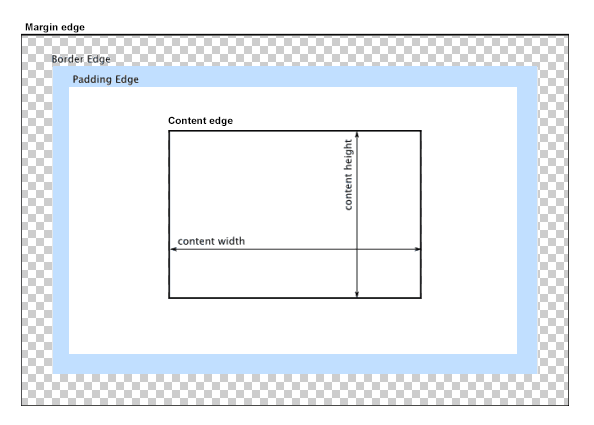
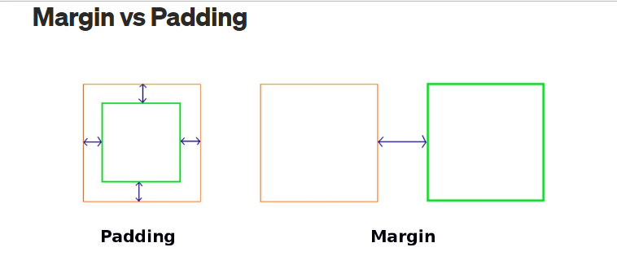

The margin CSS shorthand property sets the margin area on all four sides of an element.
https://developer.mozilla.org/en-US/docs/Web/CSS/CSS_Box_Model/Introduction_to_the_CSS_box_model#margin_area

1. Margin is an element’s personal space — how much distance the element wants to keep with other elements around it.
2. In CSS, a margin is the space around an element’s border.
3. Margins create extra space around an element, unlike padding, which creates extra space within an element.

###########################################################################################################

The margin property may be specified using one, two, three, or four values. Each value is a <length>, a <percentage>, or the keyword auto. Negative values draw the element closer to its neighbors than it would be by default.

1. When one value is specified, it applies the same margin to all four sides.
2. When two values are specified, the first margin applies to the top and bottom, the second to the left and right.
3. When three values are specified, the first margin applies to the top, the second to the right and left, the third to the bottom.
4. When four values are specified, the margins apply to the top, right, bottom, and left in that order (clockwise).

############################################################################################################

Values
1. length (The size of the margin as a fixed value).

2. percentage (The size of the margin as a percentage, relative to the width of the containing block).

3. auto (The browser selects a suitable margin to use. For example, in certain cases this value can be used to center an element).

############################################################################################################

1. The top and bottom margins have no effect on non-replaced inline elements, such as span or code.
2. Horizontal centering  
To center something horizontally in modern browsers, you can use display: flex; justify-content: center;.
3. However, in older browsers like IE8-9 that do not support Flexible Box Layout, these are not available. In order to center an element inside its parent, use margin: 0 auto;.

############################################################################################################

1. Margin collapsing (https://developer.mozilla.org/en-US/docs/Web/CSS/CSS_Box_Model/Mastering_margin_collapsing)  
Elements' top and bottom margins are sometimes collapsed into a single margin that is equal to the larger of the two margins. See Mastering margin collapsing for more information.

2. The top and bottom margins of blocks are sometimes combined (collapsed) into a single margin whose size is the largest of the individual margins (or just one of them, if they are equal), a behavior known as margin collapsing. Note that the margins of floating and absolutely positioned elements never collapse.

Margin collapsing occurs in three basic cases:

 1. Adjacent siblings  
  The margins of adjacent siblings are collapsed (except when the latter sibling needs to be cleared past floats).
 2. No content separating parent and descendants  
  If there is no border, padding, inline part, block formatting context created, or clearance to separate the margin-top of a block from the margin-top of one or more of its descendant blocks; or no border, padding, inline content, height, or min-height to separate the margin-bottom of a block from the margin-bottom of one or more of its descendant blocks, then those margins collapse. The collapsed margin ends up outside the parent.

 3. Empty blocks  
If there is no border, padding, inline content, height, or min-height to separate a block's margin-top from its margin-bottom, then its top and bottom margins collapse.

Some things to note:

More complex margin collapsing (of more than two margins) occurs when the above cases are combined.
These rules apply even to margins that are zero, so the margin of a descendant ends up outside its parent (according to the rules above) whether or not the parent's margin is zero.
When negative margins are involved, the size of the collapsed margin is the sum of the largest positive margin and the smallest (most negative) negative margin.
When all margins are negative, the size of the collapsed margin is the smallest (most negative) margin. This applies to both adjacent elements and nested elements.